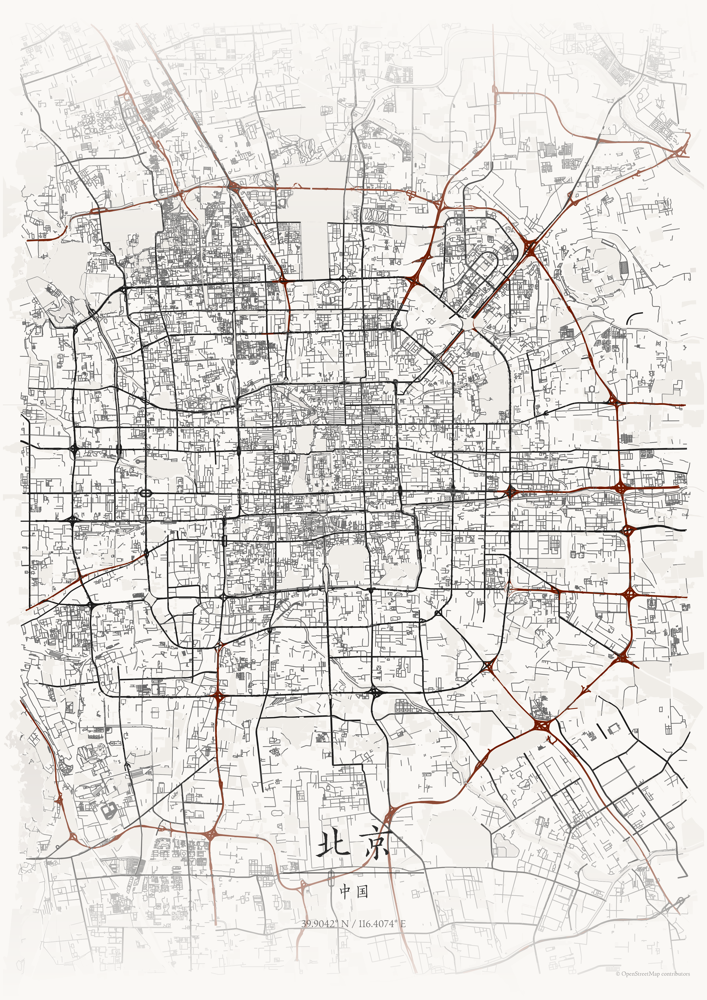
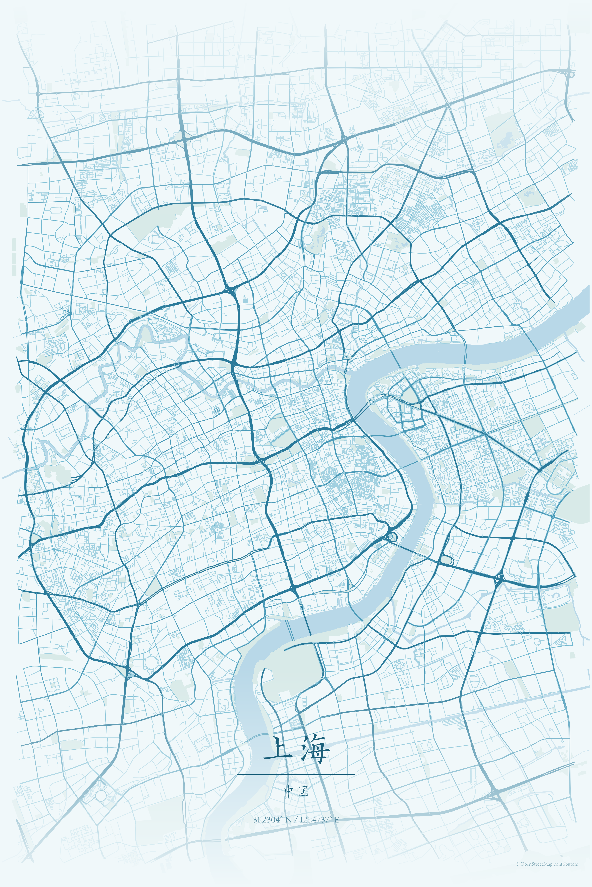
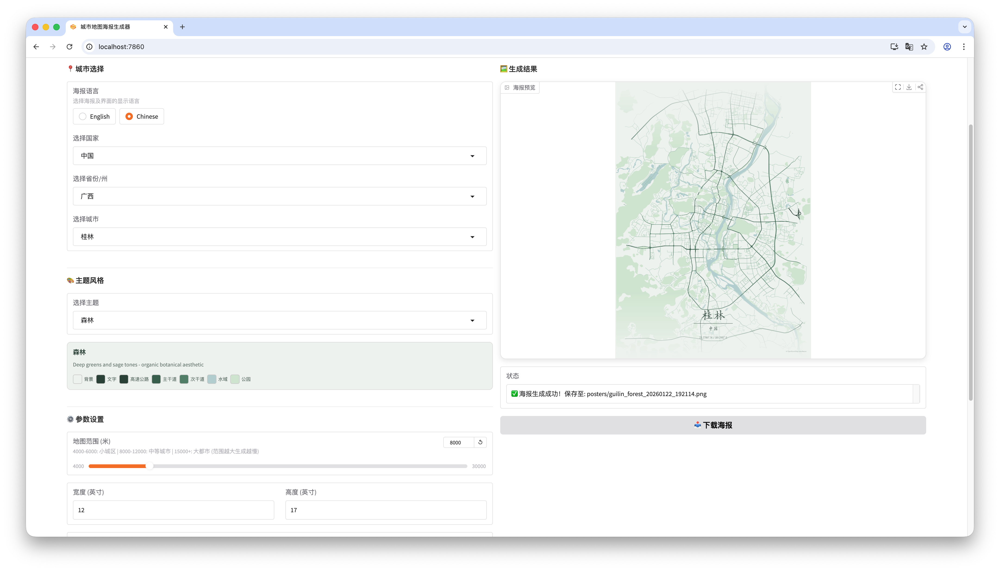
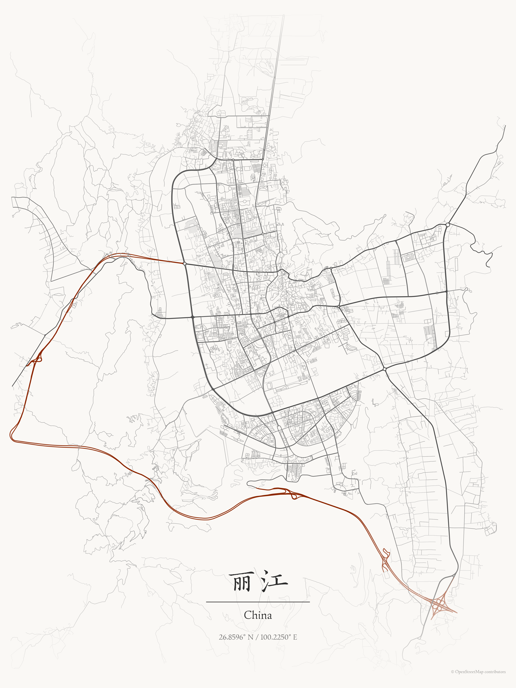
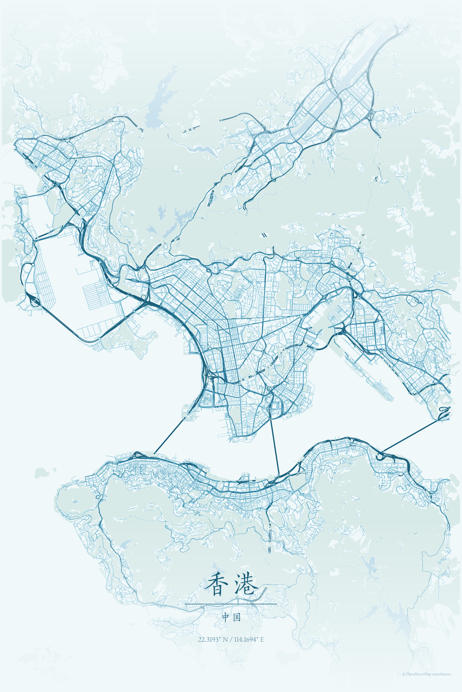

# 🌆 城市地图海报生成器 | City Map Poster Generator

<p align="center">
  <a href="#中文"><b>中文</b></a> | <a href="#english"><b>English</b></a>
</p>

<p align="center">
  <a href="https://huggingface.co/spaces/isaachwf/MapToPoster">
    
  </a>
</p>

---

## 中文

为全球任何城市生成精美、简约的地图海报。该项目基于 [originalankur/maptoposter](https://github.com/originalankur/maptoposter) 开发。

> **🚀 在线体验**：[Hugging Face Space](https://huggingface.co/spaces/isaachwf/MapToPoster)（受限于服务器资源，生成速度很慢。。。）

<p align="center">
  
  
</p>

### ⚠️ 注意事项与局限性

- **特大城市**（如北京）：可能会出现中心定位不准的问题。
- **小城市**：由于 OpenStreetMap 数据缺失，部分图层元素可能无法显示。
- **生成速度**：由于使用国外服务器资源（OSM/Nominatim）且渲染方式较基础，下载和渲染速度可能较慢。

### ✨ 特性

- **🎨 丰富主题**：内置 17+ 种精心设计的主题（从极简黑白到赛博朋克）。
- **🔍 智能选择**：支持级联选择（国家 → 省份 → 城市）或直接搜索。
- **⚙️ 高度自定义**：
    - 调整地图半径（从 4km 街道级到 30km 都市圈）。
    - 各种输出比例（A4, 方形等，通过宽/高设置）。
    - **图层控制**：自由选择显示高速、主干道、次干道、水域或公园。
- **🖼️ 多格式导出**：支持 PNG（高清打印）、SVG（矢量编辑）和 PDF。
- **🖱️ 交互界面**：基于 Gradio 的现代化 Web UI，支持实时预览。

### 界面预览

<p align="center">
  
</p>

### 🚀 快速开始

#### 安装

推荐使用 `uv` 管理项目：

```bash
# 同步环境及依赖
uv sync
```

#### 启动 Web UI

```bash
uv run python app.py
```
启动后在浏览器打开 [http://localhost:7860](http://localhost:7860)。

> **提示**：如果遇到端口冲突，可以使用 `bash restart.sh` 脚本自动清理旧进程并重启服务。

### 🖼️ 示例展示

| 国家 | 城市 | 主题 | 海报预览 |
|:---:|:---:|:---:|:---:|
| 中国 | 丽江 | japanese_ink |  |
| 中国 | 北京 | japanese_ink |  |
| 中国 | 广州 | pastel_dream |  |
| 中国 | 桂林 | forest |  |
| 中国 | 香港 | ocean |  |
| 中国 | 上海 | ocean |  |

---

如果你觉得这个项目对你有帮助，欢迎打赏两毛钱～太感谢啦～

<p align="left">
  
</p>

---

## English

Generate beautiful, minimalist map posters for any city in the world. This project is developed based on [originalankur/maptoposter](https://github.com/originalankur/maptoposter).

> **🚀 Live Demo**: [Hugging Face Space](https://huggingface.co/spaces/isaachwf/MapToPoster) (Note: Rendering is slow due to limited server resources).

### ⚠️ Limitations & Disclaimer

- **Large Metros** (e.g., Beijing): Positioning might not perfectly center on the downtown area.
- **Small Cities**: Some layers might be empty due to missing data in OpenStreetMap.
- **Performance**: Downloads and rendering can be slow as it relies on external APIs (OSM/Nominatim) and basic rendering methods.

### ✨ Features

- **🎨 Diverse Themes**: 17+ pre-designed themes (ranging from minimalist B&W to Cyberpunk).
- **🔍 Smart Selection**: Cascading selection (Country → Province → City).
- **⚙️ Highly Customizable**:
    - Adjustable map radius (4km street-level to 30km metro area).
    - custom dimensions (width/height in inches).
    - **Layer Control**: Toggle Motorways, Primary roads, Secondary roads, Water, and Parks.
- **🖼️ Multi-format Export**: Supports PNG (High-res), SVG (Vector), and PDF.
- **🖱️ Interactive UI**: Modern Web UI built with Gradio with real-time preview.

### 🖥️ UI Preview

<p align="center">
  
</p>

### 🚀 Quick Start

#### Installation

Recommended: Use `uv` for environment management:

```bash
uv sync
```

#### Launch Web UI

```bash
uv run python app.py
```
Open [http://localhost:7860](http://localhost:7860) in your browser.

> **Tip**: If you encounter port conflicts, you can use the `bash restart.sh` script to automatically clear old processes and restart the service.

### 🖼️ Examples

| Country | City | Theme | Poster |
|:---:|:---:|:---:|:---:|
| China | Lijiang | japanese_ink |  |
| China | Beijing | japanese_ink |  |
| China | Guangzhou | pastel_dream |  |
| China | Shanghai | ocean |  |

---

### 🛠️ Technical Details

- **Data Source**: © OpenStreetMap contributors
- **Geocoding**: Nominatim
- **Rendering**: OSMnx & Matplotlib


