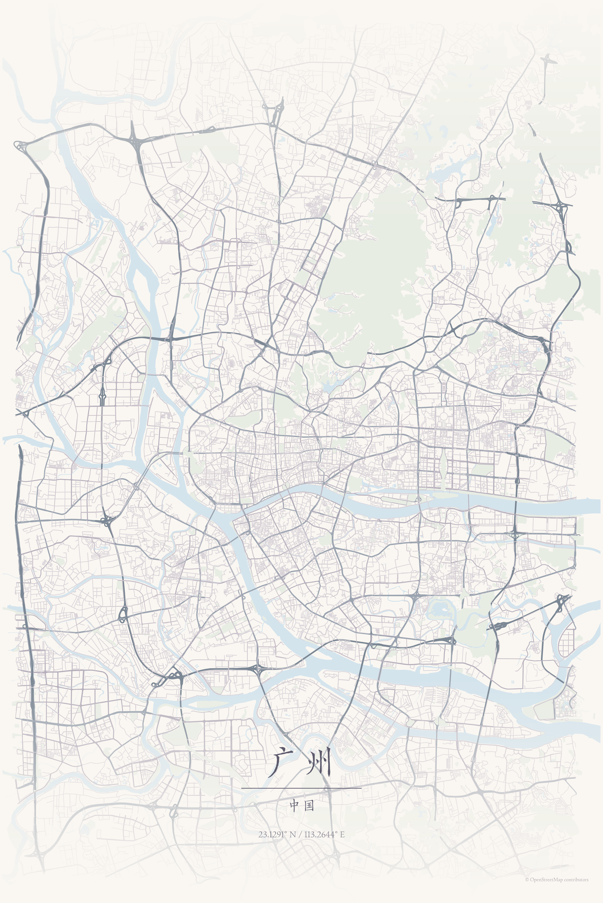
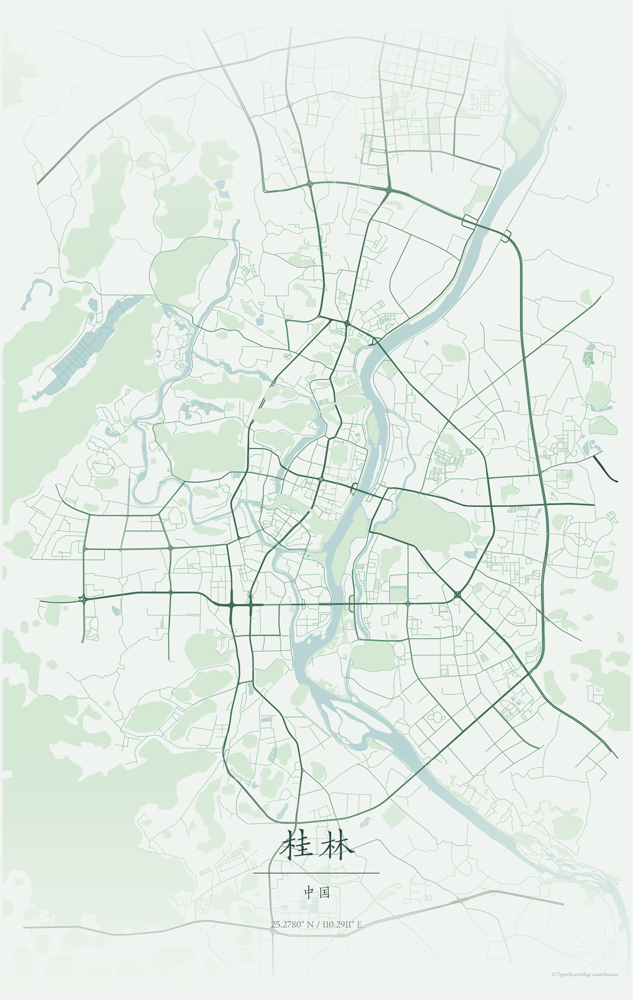

# MapToPoster

**Turn any place into a piece of art.**

[中文](#中文) · [English](#english) · [Live demo](https://huggingface.co/spaces/isaachwf/MapToPoster)


MapToPoster is an open-source map-poster editor for cities, neighbourhoods, campuses, and memorable coordinates. Search for a place, frame its streets and natural features, tune the visual system, and export a print-ready poster as PNG, SVG, or PDF.

## 中文

MapToPoster 是一个开源的地图海报编辑器。你可以搜索城市、街区、校园或坐标，调整地图取景范围，选择主题与版式，编辑文字和图层，最后导出适合分享或打印的海报。

### 在线体验

前往 [Hugging Face Space](https://huggingface.co/spaces/isaachwf/MapToPoster) 使用在线版本。项目运行在免费的 CPU Basic 硬件上：实例在闲置后会休眠，首次访问可能需要等待唤醒；地图数据和地理编码缓存保存在临时磁盘中，重启后会重新下载，不影响功能。

### 功能

- 搜索全球地点，也可以直接输入 `纬度, 经度`。
- 使用交互式地图调整中心点、缩放和海报边界。
- 内置多套 JSON 主题和布局，可从极简风格切换到赛博朋克、复古或自然色调。
- 自定义标题、副标题、说明文字、坐标、字距、对齐方式和分隔线。
- 控制高速、主干道、次干道、住宅道路、水域和公园图层。
- 支持 `3:4`、`4:5`、`2:3`、`1:1`、`9:16`、A4 和 A3 比例。
- 选择“开始生成”后才抓取地图数据，并在准备、渲染和导出阶段显示进度与耗时。
- 导出 PNG、SVG 和 PDF；PNG 支持预览分辨率或 300 DPI 打印分辨率。
- 中国行政区优先使用本地数据，其余地点通过 Nominatim 查询。

### 示例

<p align="center">
  
  
  
</p>
<p align="center">
  
  
</p>

示例展示的是同一套生成流程在不同地点和主题下的结果。OpenStreetMap 的数据完整度因地区而异，大城市或较大的取景范围通常需要更长的准备时间。

### 本地运行

要求：Python 3.12+、[uv](https://docs.astral.sh/uv/)、Node.js 22+ 和 pnpm。

```bash
uv sync --all-groups
corepack pnpm --dir frontend install --frozen-lockfile
```

开发时分别启动 API 和前端：

```bash
uv run python app.py
corepack pnpm --dir frontend dev
```

然后打开 <http://localhost:5173>。FastAPI 默认运行在 <http://localhost:7860>。

如需模拟 Hugging Face 上的单容器运行方式：

```bash
corepack pnpm --dir frontend build
uv run python app.py
```

此时打开 <http://localhost:7860>，FastAPI 会直接提供构建后的 React 页面。

### Docker

```bash
docker build -t maptoposter .
docker run --rm -p 7860:7860 maptoposter
```

镜像使用 Node 和 Python 多阶段构建，最终以非 root 用户运行单个 Uvicorn worker，并监听 `0.0.0.0:7860`。

### CLI 与 API

核心生成流程也可以通过 CLI 使用：

```bash
uv run maptoposter --help
uv run maptoposter --city "Beijing" --theme japanese_ink --output-format png
```

HTTP API 位于 `/api/v1`：

```text
GET  /api/v1/health
GET  /api/v1/styles
GET  /api/v1/layouts
GET  /api/v1/sizes
GET  /api/v1/locations/search?q=Paris
POST /api/v1/map-data/prepare
POST /api/v1/posters/preview
POST /api/v1/posters/export
```

### 测试与代码检查

```bash
uv run pytest
uv run ruff check src backend tests app.py create_map_poster.py
uv run pyright
corepack pnpm --dir frontend test
corepack pnpm --dir frontend lint
corepack pnpm --dir frontend build
```

### 部署

GitHub `main` 是唯一源码分支。每次推送都会先运行 Python、React 和 Docker 检查，全部通过后再由 GitHub Actions 将文件镜像到现有的 [Hugging Face Space](https://huggingface.co/spaces/isaachwf/MapToPoster)。部署、Token 配置、缓存和回滚说明见 [Hugging Face 部署文档](docs/huggingface_deployment.md)。

## English

### Features

- Search worldwide places or enter `latitude, longitude` manually.
- Pan and zoom an interactive map to frame the poster.
- Choose from a growing collection of JSON themes and layout presets.
- Edit titles, subtitles, captions, coordinates, tracking, alignment, and dividers.
- Toggle motorway, primary, secondary, residential, water, and park layers.
- Use `3:4`, `4:5`, `2:3`, `1:1`, `9:16`, A4, and A3 size presets.
- Start generation explicitly, with visible progress and elapsed time for data preparation, rendering, and export.
- Export PNG, SVG, or PDF; PNG supports preview and 300 DPI print output.
- Resolve Chinese administrative areas locally before falling back to Nominatim.

### Local development

Requirements: Python 3.12+, [uv](https://docs.astral.sh/uv/), Node.js 22+, and pnpm.

```bash
uv sync --all-groups
corepack pnpm --dir frontend install --frozen-lockfile
```

Start the API and frontend development server in separate terminals:

```bash
uv run python app.py
corepack pnpm --dir frontend dev
```

Open <http://localhost:5173>. The API runs at <http://localhost:7860>.

For a production-style local run:

```bash
corepack pnpm --dir frontend build
uv run python app.py
```

Open <http://localhost:7860>; FastAPI serves the built React application directly.

### Architecture

```text
React + TypeScript editor
        ↓ JSON requests and image responses
FastAPI application layer
        ↓ typed PosterConfig and MapDataRef
MapToPoster core
        ├── local and Nominatim geocoding
        ├── OpenStreetMap acquisition and cache
        ├── themes, layouts, typography, and viewport models
        └── Matplotlib renderer
        ↓
PNG / SVG / PDF
```

### Hosted application and deployment

The latest `main` build is available on the free [Hugging Face Space](https://huggingface.co/spaces/isaachwf/MapToPoster). The Space uses Docker on CPU Basic hardware. Free instances sleep after inactivity, and `/data` is temporary storage, so cached map data may need to be downloaded again after a restart.

Pushes to GitHub `main` run the complete validation workflow and publish only after all checks succeed. If validation or the Docker build fails, the existing Space version is left untouched. See [docs/huggingface_deployment.md](docs/huggingface_deployment.md) for deployment and rollback details.

### Contributing

Contributions are welcome. Before opening a pull request:

1. Create a focused branch from `main`.
2. Keep user-facing text bilingual where it is part of the product UI.
3. Add or update tests for behavioural changes.
4. Run the Python and frontend checks listed above.
5. Describe the change, verification steps, and any OpenStreetMap or rendering implications.

Please avoid committing generated posters, local caches, credentials, or large binary files outside the documented Git LFS assets. For substantial changes, open an issue first so the design and scope can be discussed.

### Data, attribution, and licensing

Roads, water, parks, and external geocoding results come from OpenStreetMap services. Map data and derived geometries are © OpenStreetMap contributors. Use an identifiable `MAPTOPOSTER_USER_AGENT` for non-Docker deployments and follow the relevant upstream usage policies. Data completeness varies by location, and large viewports can take longer to prepare.

See [LICENSE](LICENSE) for the project license. Review the bundled font licenses before redistributing the font files.
