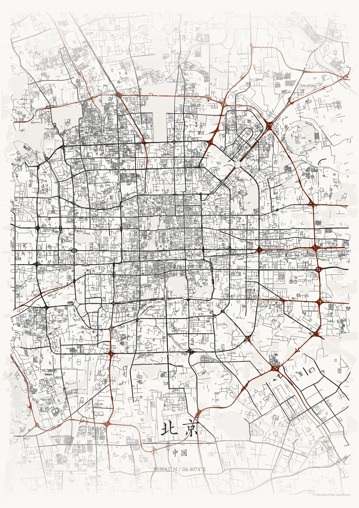

# MapToPoster

**把任何地方变成一张地图艺术海报。 / Turn any place into a piece of art.**

[中文](#中文) · [English](#english) · [在线体验 / Live demo](https://huggingface.co/spaces/isaachwf/MapToPoster)



## 中文

MapToPoster 是一个地图海报编辑器。你可以搜索城市、街区、校园或坐标，在交互地图中调整取景范围，再编辑主题、版式、文字、图层和纸张比例，最后导出 PNG、SVG 或 PDF。

### 主要功能

- 搜索全球地点，也支持直接输入 `纬度, 经度`。
- 使用 MapLibre 交互调整中心点、缩放和海报边界。
- 内置 17 套 JSON 主题和 5 种排版布局。
- 自定义标题、副标题、说明文字、坐标、字距、对齐和分隔线。
- 控制高速、主干道、次干道、住宅道路、水域和公园图层。
- 支持 3:4、4:5、2:3、1:1、9:16、A4 和 A3。
- 快速低分辨率预览，以及 300 DPI PNG、SVG、PDF 导出。
- 中国行政区优先使用本地数据，其余位置通过 Nominatim 搜索。

### 在线版本

最新版部署在 [Hugging Face Space](https://huggingface.co/spaces/isaachwf/MapToPoster)，使用免费的 CPU Basic 硬件。免费实例闲置后会休眠，第一次访问可能需要等待唤醒。

地图数据和地理编码缓存位于容器的 `/data` 目录。免费硬件没有永久磁盘，Space 重启后缓存会被清空，但不会影响功能，只会让下一次生成重新下载 OpenStreetMap 数据。

### 本地开发

项目要求 Python 3.12+、[uv](https://docs.astral.sh/uv/) 和 Node.js 22+。前端依赖由 pnpm 管理。

```powershell
uv sync --all-groups
corepack pnpm --dir frontend install --frozen-lockfile
```

在两个终端中启动 API 和前端开发服务器：

```powershell
uv run python app.py
corepack pnpm --dir frontend dev
```

打开 <http://localhost:5173>。FastAPI 位于 <http://localhost:7860>。

生产模式本地运行：

```powershell
corepack pnpm --dir frontend build
uv run python app.py
```

此时打开 <http://localhost:7860>，FastAPI 会直接提供构建后的 React 页面。

### Docker

```bash
docker build -t maptoposter .
docker run --rm -p 7860:7860 maptoposter
```

Docker 镜像使用 Node 多阶段构建前端，并以非 root 用户运行单个 Uvicorn worker。详细部署、凭据和回滚说明见 [Hugging Face 部署文档](docs/huggingface_deployment.md)。

### 测试

```powershell
uv run pytest
uv run ruff check src backend tests app.py create_map_poster.py
uv run pyright
corepack pnpm --dir frontend test
corepack pnpm --dir frontend lint
corepack pnpm --dir frontend build
```

### CLI 与 API

```powershell
uv run maptoposter --help
uv run maptoposter --city "Beijing" --theme japanese_ink --output-format png
```

```text
GET  /api/v1/health
GET  /api/v1/styles
GET  /api/v1/layouts
GET  /api/v1/sizes
GET  /api/v1/locations/search?q=Paris
POST /api/v1/map-data/prepare
POST /api/v1/posters/preview
POST /api/v1/posters/export
```

## English

MapToPoster is a map-poster editor for cities, neighbourhoods, campuses, and meaningful coordinates. Frame a place in the interactive map, customize its style and typography, then export a print-ready poster.

### Features

- Search worldwide locations or enter `latitude, longitude` directly.
- Pan and zoom an interactive MapLibre viewport to frame the poster.
- Choose from 17 JSON themes and five layout presets.
- Edit titles, subtitles, captions, coordinates, tracking, alignment, and dividers.
- Toggle motorway, primary, secondary, residential, water, and park layers.
- Use 3:4, 4:5, 2:3, 1:1, 9:16, A4, and A3 size presets.
- Generate quick previews and export 300 DPI PNG, SVG, or PDF files.
- Resolve Chinese administrative areas locally before contacting Nominatim.

### Hosted application

The latest `main` build runs on the free [Hugging Face Space](https://huggingface.co/spaces/isaachwf/MapToPoster). Free CPU Basic instances sleep after inactivity, so the first visit may need time to wake the application.

Map and geocoding caches use `/data` inside the container. Free hardware does not provide persistent disk storage: a restart clears the cache, but the application remains functional and downloads the required OpenStreetMap data again.

### Local development

The project requires Python 3.12+, [uv](https://docs.astral.sh/uv/), and Node.js 22+. pnpm manages the frontend dependencies.

```powershell
uv sync --all-groups
corepack pnpm --dir frontend install --frozen-lockfile
```

Start the API and frontend development server in separate terminals:

```powershell
uv run python app.py
corepack pnpm --dir frontend dev
```

Open <http://localhost:5173>. The API runs at <http://localhost:7860>.

For a production-style local run:

```powershell
corepack pnpm --dir frontend build
uv run python app.py
```

Open <http://localhost:7860>; FastAPI serves the built React application directly.

### Architecture

```text
React + TypeScript editor
        ↓ JSON / image bytes
FastAPI application layer (backend/)
        ↓ PosterConfig / MapDataRef
MapToPoster core (src/maptoposter/)
        ├── local and Nominatim geocoding
        ├── OSM acquisition and GeoPackage cache
        ├── typed themes, layouts, typography, and viewport models
        └── network-free Matplotlib renderer
        ↓
PNG / SVG / PDF
```

### Deployment

Every push to GitHub `main` runs the Python checks, frontend checks, and a Linux Docker smoke test. A successful workflow mirrors the repository to the Hugging Face Space `main` branch. Deployment and rollback instructions are in [docs/huggingface_deployment.md](docs/huggingface_deployment.md).

## Data and licensing

Roads, water, parks, and external geocoding results come from OpenStreetMap services. Provide an identifiable `MAPTOPOSTER_USER_AGENT` for non-Docker deployments and respect the upstream usage policies. Data completeness varies by location, and large viewports can take longer to prepare.

See [LICENSE](LICENSE) for the project license and review the bundled font licenses before redistributing them. Map data and derived geometries are © OpenStreetMap contributors.
